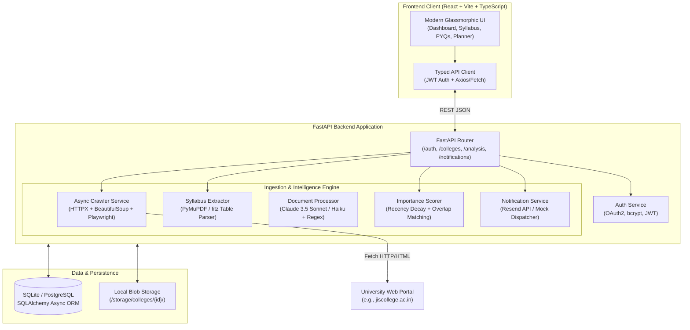

# 🎓 ExamBuddy — Autonomous AI Exam Preparation Copilot

[](https://exambuddy-psi.vercel.app)
[](https://github.com/akash-das-37/ExamBuddy)
[](https://python.org)
[](https://fastapi.tiangolo.com)
[](https://react.dev)
[](https://www.typescriptlang.org)
[](https://vitejs.dev)

> **ExamBuddy** is an end-to-end, AI-powered academic copilot built for college and university students. It autonomously crawls official university websites, discovers curriculum regulations, parses syllabus tables & modular topics via **PyMuPDF**, matches previous year exam questions (PYQs), scores high-yield study topics using a **recency-weighted mathematical decay algorithm**, and dispatches targeted circular alerts.

---

## 📌 Table of Contents

1. [The Problem](#-the-problem)
2. [The Solution](#-the-solution)
3. [Live Application](#-live-application)
4. [High-Level Architecture](#-high-level-architecture)
5. [Core Pipelines](#-core-pipelines)
   - [1. Autonomous College Crawler](#1-autonomous-college-crawler)
   - [2. Syllabus Discovery & PyMuPDF Table Extractor](#2-syllabus-discovery--pymupdf-table-extractor)
   - [3. PYQ Ingestion & Question Bank](#3-pyq-ingestion--question-bank)
   - [4. Mathematical Topic Scoring & Study Planner](#4-mathematical-topic-scoring--study-planner)
   - [5. Official Circular & Notice Monitor](#5-official-circular--notice-monitor)
6. [Mathematical Scoring Formulation](#-mathematical-scoring-formulation)
7. [Technology Stack](#-technology-stack)
8. [Project Structure](#-project-structure)
9. [Getting Started (Local Development)](#-getting-started-local-development)
10. [REST API Documentation](#-rest-api-documentation)
11. [Deployment Guide (Vercel & Cloud)](#-deployment-guide)

---

## 🛑 The Problem

College and university students face recurring academic hurdles every semester:

1. **Fragmented & Chaotic College Portals**: Syllabi, course blueprints, academic notices, and exam routines are scattered across buried subpages, broken links, and hundreds of miscellaneous PDFs.
2. **Regulation & Syllabus Ambiguity**: Autonomous institutions and state universities frequently update curriculum regulations (e.g., R18, R21, R23, R25). Students frequently study obsolete modules or struggle to find the exact syllabus for their batch.
3. **Unstructured Exam Preparation**: Students collect past year question papers (PYQs) as unsearchable scans or images, forcing them to guess which topics carry the highest exam probability.
4. **Missed Deadlines & Urgent Circulars**: Examination form fill-ups, PPR (post-publication review), admit card enrollment, and schedule postponements are posted as opaque PDF notices that students frequently overlook until late fees apply.

---

## 💡 The Solution

**ExamBuddy** transforms chaotic institutional websites into a personalized, data-driven academic intelligence hub:

* 🌐 **Autonomous University Portal Crawler**: An async, rate-limited bot that inspects college portals, handles robots.txt compliance, follows navigation hierarchies, and downloads relevant academic artifacts.
* ⚡ **Deep Table & Module Extraction (PyMuPDF)**: Automatically scans university pages for syllabus regulations (e.g. `CSE-R25.pdf`), extracts semester-wise course tables (course codes like `CS201`, `EC(CS)301`, contact hours `3L-0T-0P`, credit points), and indexes granular module topics.
* 📊 **Recency-Weighted PYQ Analytics**: Employs token-overlap matching and time-decay functions to calculate a quantitative importance score for each syllabus topic based on frequency, recency, and marks allotment.
* 🎯 **3-Tiered AI Study Planner**: Segregates course topics into **Tier 1 (High Priority)**, **Tier 2 (Medium Priority)**, and **Tier 3 (Breadth Coverage)** with contextual preparation reasoning.
* 🔔 **Targeted Notice Alerts**: Automatically classifies notices and alerts students enrolled in affected branches and semesters.
* 🖥️ **Sleek Cyber-Dark Dashboard**: Built with a 250px glowing sidebar, glassmorphic card elevations, semester blueprint filters, and past-year question search.

---

## 🌐 Live Application

* **Production URL**: [https://exambuddy-psi.vercel.app](https://exambuddy-psi.vercel.app)
* **GitHub Repository**: [https://github.com/akash-das-37/ExamBuddy](https://github.com/akash-das-37/ExamBuddy)

---

## 🏗️ High-Level Architecture



---

## ⚙️ Core Pipelines

### 1. Autonomous College Crawler
* Implemented in [`app/services/crawler.py`](file:///c:/Users/iamne/OneDrive/Desktop/ExamBuddy/app/services/crawler.py).
* Prioritizes priority keywords (`syllabus`, `curriculum`, `notice`, `circular`, `exam`, `pyq`).
* Employs polite request pacing with configurable delay (`CRAWLER_REQUEST_DELAY = 1.0s`) and depth bounds (`max_depth = 3`).
* Built with resumability: avoids re-downloading pages visited within `CRAWLER_RECENCY_SKIP_HOURS`.
* Falls back to headless Chromium (Playwright) when dynamic JavaScript client-rendering is detected.

### 2. Syllabus Discovery & PyMuPDF Table Extractor
* Implemented in [`app/services/syllabus_extractor.py`](file:///c:/Users/iamne/OneDrive/Desktop/ExamBuddy/app/services/syllabus_extractor.py).
* **Portal Discovery**: Evaluates standard curriculum endpoints (`/curriculum-syllabus.php`, `/syllabus.php`, `/academics`) and navigation trees.
* **Regulation Matcher**: Scores candidate syllabus documents by branch (`CSE`, `IT`, `ECE`, `ME`, `CE`, etc.) and regulation codes (`R25`, `R24`, `R23`, `R21`).
* **Table Extraction**: Uses PyMuPDF's `fitz.Page.find_tables()` to parse course structures across semester pages.
* **Robust Code Matching**: Captures single-letter, alphanumeric, and parenthesized course codes (e.g. `CS301`, `EC(CS)301`, `M(CS)301`, `HU(CS)501`, `CS391`).
* **Modular Breakdown**: Scans subsequent pages for course outlines to extract individual modules (`Module 1`, `Module 2`, etc.) with comprehensive topic descriptions.

### 3. PYQ Ingestion & Question Bank
* Extracts numbered questions, section titles, allotted marks, and exam years from past university exam papers.
* Supports both LLM-powered extraction (Claude 3.5 Sonnet) and zero-cost heuristic regex fallbacks.
* Populates dedicated question records in [`PYQQuestion`](file:///c:/Users/iamne/OneDrive/Desktop/ExamBuddy/app/models/pyq.py) linked to the college and course.

### 4. Mathematical Topic Scoring & Study Planner
* Maps past examination questions to extracted syllabus units using token overlap and technical keyword analysis.
* Evaluates topic frequency and penalizes aged appearances using mathematical decay.
* Segregates topics into actionable revision tiers (**High Priority**, **Medium Priority**, **Low Priority**) with natural-language reasoning.

### 5. Official Circular & Notice Monitor
* Identifies exam schedules, postponement circulars, form fill-up deadlines, and PPR notifications.
* Automatically matches circulars against enrolled students based on degree course and active semester.
* Delivers live alerts in the web dashboard and sends email dispatches via Resend API.

---

## 📐 Mathematical Scoring Formulation

For each syllabus topic $T$, its importance score $S(T)$ is derived from all past exam questions $q \in PYQ(T)$ matched to it:

$$S_{\text{raw}}(T) = \sum_{q \in PYQ(T)} W_{\text{recency}}(q) \times W_{\text{marks}}(q)$$

### 1. Recency Decay Function
Recent examination trends reflect revised university priorities. Questions from recent years receive higher weight:

$$W_{\text{recency}}(q) = \frac{1.0}{1.0 + 0.25 \times (Y_{\text{current}} - Y_{\text{exam}})}$$

* An appearance in the immediate prior year carries a weight of $\approx 0.80$.
* An appearance 4 years prior decays to $\approx 0.50$.

### 2. Marks Normalization
Questions with higher point values signify comprehensive conceptual questions:

$$W_{\text{marks}}(q) = \frac{\text{Marks}(q)}{10.0}$$

### 3. Scaled Importance Score
The final score is normalized to a $[0, 100]$ scale with a guaranteed $+10$ point baseline for topics that have appeared on past papers:

$$S_{\text{final}}(T) = \min\left(100, \; \left( \frac{S_{\text{raw}}(T)}{\max_{t} S_{\text{raw}}(t)} \times 90.0 \right) + 10.0 \right)$$

### 4. Study Priority Tiers
* **Tier 1 (High Priority)**: $S_{\text{final}} \ge 70$ — Mandatory core concepts that appear consistently across recent examinations.
* **Tier 2 (Medium Priority)**: $40 \le S_{\text{final}} < 70$ — Important supporting topics that appear periodically.
* **Tier 3 (Low Priority)**: $S_{\text{final}} < 40$ — Peripheral syllabus items for comprehensive score maximization.

---

## 💻 Technology Stack

| Layer | Technologies | Rationale |
|---|---|---|
| **Frontend Framework** | **React 18, TypeScript, Vite** | Fast SPA rendering, strict type safety, zero runtime bloat |
| **Frontend Styling** | **Vanilla CSS (Design Tokens)** | Custom dark-mode glassmorphic theme without heavy Tailwind overhead |
| **Backend Framework** | **Python 3.12, FastAPI, Uvicorn** | High-performance asynchronous REST API, auto-generating OpenAPI docs |
| **PDF Extraction** | **PyMuPDF (`fitz`) 1.25.1** | Fast C-compiled PDF table extraction, eliminates external LLM cost for syllabus |
| **Crawler & Scraping** | **HTTPX, BeautifulSoup4, Playwright** | Async non-blocking network calls with headless browser fallback for JS portals |
| **Database & ORM** | **SQLAlchemy 2.0 (Async), aiosqlite / PostgreSQL, Alembic** | Async database access, seamless migrations, SQLite for local / Postgres for prod |
| **AI / LLM Layer** | **Anthropic Claude 3.5 (Sonnet / Haiku)** | Deep document classification and semantic question boundary detection |
| **Notification Engine**| **Resend API / SMTP** | Multi-channel student notice alert dispatcher |
| **Cloud Deployment** | **Vercel (Frontend)**, **Docker / VPS (Backend)** | Edge-hosted frontend distribution with global CDN caching |

---

## 📂 Project Structure

```bash
ExamBuddy/
├── app/                            # Backend FastAPI Application
│   ├── core/                       # App configuration, security & JWT utilities
│   │   ├── config.py               # Pydantic BaseSettings (.env loader)
│   │   └── security.py             # Password hashing (bcrypt) & JWT token handlers
│   ├── db/                         # Database connection & async session factory
│   │   └── __init__.py             # SQLAlchemy async engine & Base
│   ├── models/                     # SQLAlchemy ORM database models
│   │   ├── college.py              # College entity & scrape status
│   │   ├── student.py              # User profiles (course, branch, semester)
│   │   ├── document.py             # Downloaded files & extracted text
│   │   ├── syllabus.py             # Syllabus entries & importance scores
│   │   ├── pyq.py                  # Past examination questions & matched topics
│   │   ├── notice.py               # Circulars & delivery notification logs
│   │   └── scraped_page.py         # Visited web pages & HTML cache
│   ├── routers/                    # REST API route handlers
│   │   ├── auth.py                 # /auth (login, signup, /me)
│   │   ├── colleges.py             # /colleges (crawl, syllabus, pyqs, search-syllabus)
│   │   ├── analysis.py             # /analysis (importance score compute, study reports)
│   │   └── notifications.py        # /notifications (student alerts & preferences)
│   ├── schemas/                    # Pydantic validation and serialization models
│   │   ├── auth.py                 # Login / signup payload schemas
│   │   ├── extraction.py           # Syllabus, PYQ, and notice response schemas
│   │   └── analysis.py             # Ranked topics & study tier schemas
│   ├── services/                   # Business logic & pipeline implementations
│   │   ├── crawler.py              # Async priority-queue web crawler
│   │   ├── syllabus_extractor.py   # Discovery & PyMuPDF table extraction engine
│   │   ├── processor.py            # Document classification & parsing pipeline
│   │   ├── analysis_service.py     # Recency decay scoring & topic matching
│   │   ├── llm_service.py          # Anthropic Claude client with heuristic fallbacks
│   │   ├── email_service.py        # Email circular notifications (Resend / mock)
│   │   └── storage.py              # Local disk storage service for PDFs
│   └── main.py                     # FastAPI entrypoint, middleware, static mount
├── frontend/                       # Vite + React + TypeScript Web App
│   ├── src/
│   │   ├── api/                    # Client API connectors
│   │   │   └── client.ts           # Centralized typed fetch client (VITE_API_BASE)
│   │   ├── components/             # Reusable UI components
│   │   │   ├── Navbar.tsx          # Top navigation bar
│   │   │   └── Sidebar.tsx         # Fixed left navigation sidebar (250px)
│   │   ├── pages/                  # Top-level views
│   │   │   ├── HomePage.tsx        # Hero landing page
│   │   │   ├── LoginPage.tsx       # Sign in authentication
│   │   │   ├── AuthPage.tsx        # Registration with college selection
│   │   │   ├── Dashboard.tsx       # Student dashboard & overview statistics
│   │   │   ├── SyllabusPage.tsx    # Curriculum explorer & PyMuPDF discovery
│   │   │   ├── PyqPage.tsx         # Question bank & past exam archive
│   │   │   └── StudyReportPage.tsx # AI revision planner & topic ranking
│   │   ├── types/                  # Global TypeScript interface definitions
│   │   ├── App.tsx                 # Client router & navigation state
│   │   └── index.css               # Vanilla CSS design system & tokens
│   ├── package.json                # Dependencies & build scripts
│   ├── vite.config.ts              # Vite bundle configuration
│   └── vercel.json                 # Vercel deployment & SPA rewrite rules
├── alembic/                        # Database migration scripts
├── tests/                          # Automated test suites (pytest)
├── .env.example                    # Sample environment variables template
├── .gitignore                      # Git exclusion rules
└── README.md                       # Comprehensive documentation
```

---

## 🚀 Getting Started (Local Development)

### Prerequisites
* **Python**: `3.12+`
* **Node.js**: `18.0+`
* **npm**: `9.0+`

---

### 1. Clone the Repository
```bash
git clone https://github.com/akash-das-37/ExamBuddy.git
cd ExamBuddy
```

---

### 2. Backend Setup

1. **Create and activate a Python virtual environment**:
   ```bash
   # Windows PowerShell
   python -m venv .venv
   .venv\Scripts\Activate.ps1

   # Linux / macOS
   python3 -m venv .venv
   source .venv/bin/activate
   ```

2. **Install Python dependencies**:
   ```bash
   pip install -r requirements.txt
   ```

3. **Configure Environment Variables**:
   Copy `.env.example` to `.env`:
   ```bash
   cp .env.example .env
   ```
   *(ExamBuddy runs out-of-the-box in local development with SQLite and built-in heuristic fallbacks even without an Anthropic API key.)*

4. **Initialize Database Tables**:
   ```bash
   python -c "import asyncio; from app.db import init_db; asyncio.run(init_db())"
   ```

5. **Start the FastAPI backend server**:
   ```bash
   python -m uvicorn app.main:app --host 127.0.0.1 --port 8000 --reload
   ```
   * Interactive API Swagger Docs: [http://127.0.0.1:8000/docs](http://127.0.0.1:8000/docs)
   * Alternative ReDoc: [http://127.0.0.1:8000/redoc](http://127.0.0.1:8000/redoc)

---

### 3. Frontend Setup

1. **Navigate to the frontend directory**:
   ```bash
   cd frontend
   ```

2. **Install Node dependencies**:
   ```bash
   npm install
   ```

3. **Start the Vite development server**:
   ```bash
   npm run dev
   ```
   * Open your browser at [http://localhost:5173](http://localhost:5173) (or [http://127.0.0.1:8000](http://127.0.0.1:8000) when served via FastAPI).

4. **Build production bundle**:
   ```bash
   npm run build
   ```

---

## 📡 REST API Documentation

### Authentication (`/auth`)
| Method | Endpoint | Description |
|---|---|---|
| `POST` | `/auth/signup` | Register a new student profile with college, branch, and semester |
| `POST` | `/auth/login` | Authenticate with email/password and receive a Bearer JWT |
| `GET` | `/auth/me` | Fetch authenticated student profile |

### Colleges & Portal Extraction (`/colleges`)
| Method | Endpoint | Description |
|---|---|---|
| `GET` | `/colleges/{college_id}` | Retrieve college metadata and scraping status |
| `POST` | `/colleges/{college_id}/scrape` | Trigger asynchronous portal crawl |
| `GET` | `/colleges/{college_id}/scrape/status` | Real-time page and document count metrics |
| `POST` | `/colleges/{college_id}/search-syllabus` | **Autonomous PyMuPDF discovery & extraction of curriculum regulations** |
| `GET` | `/colleges/{college_id}/syllabus` | Retrieve structured syllabus entries with branch & semester filters |
| `GET` | `/colleges/{college_id}/pyqs` | Retrieve past year exam questions |
| `GET` | `/colleges/{college_id}/notices` | Retrieve parsed administrative notices & circulars |

### Exam Intelligence & Study Planner (`/analysis`)
| Method | Endpoint | Description |
|---|---|---|
| `POST` | `/analysis/{subject}/compute` | Calculate recency-weighted importance scores for subject topics |
| `GET` | `/analysis/{subject}/ranked-topics` | Retrieve ranked syllabus topics sorted by exam probability |
| `GET` | `/students/me/study-report` | Generate complete 3-tier study report for the authenticated student |

### Notifications (`/notifications`)
| Method | Endpoint | Description |
|---|---|---|
| `GET` | `/notifications/me` | Retrieve circular alerts delivered to the student |
| `PATCH` | `/notifications/preferences` | Enable or disable email circular dispatch |

---

## ☁️ Deployment Guide

### Deploying the Frontend to Vercel
ExamBuddy is configured for Vercel deployment:

1. **Install Vercel CLI**:
   ```bash
   npm install -g vercel
   ```
2. **Deploy from `frontend/`**:
   ```bash
   cd frontend
   vercel --prod
   ```
3. Set the environment variable in your Vercel Project Settings:
   * `VITE_API_BASE`: `https://your-backend-api-domain.com` (or your cloud backend URL).

---

## 🛡️ Security & Privacy

* **Encrypted Passwords**: Uses `bcrypt` password hashing with per-user salt.
* **Stateless Tokens**: Secure JWT authentication (`HS256`) with configurable expiration.
* **Domain Restrictions**: Crawler operates strictly on domain and subdomains of the designated college.
* **Input Sanitization**: Pydantic v2 validation safeguards all API ingest points.

---

## 📄 License

This project is licensed under the **MIT License**.

---

<p align="center">
  <b>Built with ❤️ for college students navigating exam preparation.</b><br />
  <sub>ExamBuddy • Autonomous AI Academic Copilot</sub>
</p>
