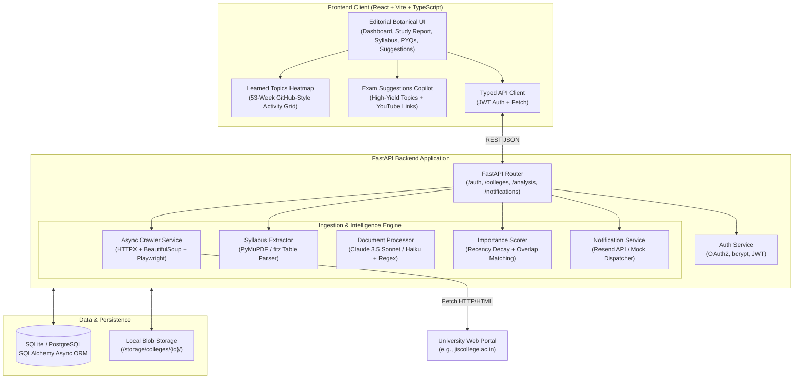

# 🎓 ExamBuddy — Autonomous AI Exam Preparation Copilot

[](https://exambuddy-akr.vercel.app)
[](https://github.com/akash-das-37/ExamBuddy)
[](https://python.org)
[](https://fastapi.tiangolo.com)
[](https://react.dev)
[](https://www.typescriptlang.org)
[](https://vitejs.dev)

> **ExamBuddy** is an autonomous academic intelligence copilot built for developers, engineers, and technical students. Tech students spend their semester building real projects, grinding LeetCode, and developing industry skills—leaving college academics for the last minute. When exams knock at the door, ExamBuddy uses automated portal crawling, **PyMuPDF table extraction**, a **recency-weighted mathematical decay algorithm**, and a **GitHub-style study activity heatmap** to distill massive syllabi and past papers into an actionable, high-yield revision blueprint.

---

## 📌 Table of Contents

1. [The Real Problem: The Coder's Dilemma](#-the-real-problem-the-coders-dilemma)
2. [The Solution: Pareto Exam Intelligence](#-the-solution-pareto-exam-intelligence)
3. [Live Application](#-live-application)
4. [Key Features & User Modules](#-key-features--user-modules)
   - [1. GitHub-Style Learned Topics Heatmap](#1-github-style-learned-topics-heatmap)
   - [2. High-Yield Exam Suggestions & Video Drills](#2-high-yield-exam-suggestions--video-drills)
   - [3. Dynamic Semester Syllabus Blueprint](#3-dynamic-semester-syllabus-blueprint)
   - [4. PYQ Question Bank & Multi-Format Ingestion](#4-pyq-question-bank--multi-format-ingestion)
   - [5. AI Study Planner & Daily Goal Tracker](#5-ai-study-planner--daily-goal-tracker)
   - [6. Autonomous College Crawler & Notice Watchdog](#6-autonomous-college-crawler--notice-watchdog)
5. [High-Level Architecture](#-high-level-architecture)
6. [Mathematical Scoring Formulation](#-mathematical-scoring-formulation)
7. [Technology Stack](#-technology-stack)
8. [Project Structure](#-project-structure)
9. [Getting Started (Local Development)](#-getting-started-local-development)
10. [REST API Documentation](#-rest-api-documentation)
11. [Deployment Guide (Vercel & Cloud)](#-deployment-guide)

---

## 🛑 The Real Problem: The Coder's Dilemma

Students in technical fields (Computer Science, Information Technology, AI/ML, Engineering) face a common, high-stakes dilemma every semester:

* 💻 **Skills Over Slides**: Ambitious technical students spend 90% of their semester focusing on real-world engineering—writing code, building full-stack applications, solving DSA problems, hacking open-source, and preparing for tech interviews. They intentionally tune out dense, outdated classroom slide decks.
* ⏰ **The Exam Panic Door**: When semester exams suddenly "knock at the door" (1–2 weeks before exam night), reality hits. Students are faced with 5–6 heavy theoretical papers with zero structured preparation.
* 🌪️ **Chaos in the Portal**: They scramble to find what to study:
  1. **Buried Regulations**: College websites are labyrinths of broken links, outdated PDF circulars, and conflicting curriculum versions (e.g., R18 vs R21 vs R23 vs R25).
  2. **500-Page Overload**: Trying to read massive textbooks cover-to-cover in 48 hours is impossible and demoralizing.
  3. **Blind PYQ Guesswork**: Past year question papers (PYQs) are unsearchable scans scattered across messaging groups. Students have no data on which questions repeat or carry maximum marks.
  4. **Missed Administrative Deadlines**: Important circulars regarding exam form fill-up deadlines, admit card enrollment, and schedule postponements get lost in bureaucratic portals.
  5. **Unfair GPA Penalties**: Exceptionally talented programmers suffer GPA drops simply because they lack the time to manually decipher college exam patterns.

---

## 💡 The Solution: Pareto Exam Intelligence

**ExamBuddy** bridges the gap between technical passion and academic survival. It applies the **Pareto Principle (the 80/20 Rule)** to semester exams: *identify the top ~20% of high-yield concepts that produce ~80% of examination marks.*

* ⚡ **1-Click Curriculum Discovery (PyMuPDF)**: Automatically scans university portals, discovers the official regulation PDF (e.g. `CSE-R23.pdf`), parses semester course tables (`CS301`, `EC(CS)301`, `M(CS)301`, labs, contact hours, and credits), and breaks down modular topics in seconds.
* 🎯 **3-Tier Emergency Revision Planner**:
  * **Tier 1 (Core Must-Pass)**: High-frequency, recurring exam topics to secure passing marks and strong baseline grades in minimal hours.
  * **Tier 2 (Grade Booster)**: Moderately tested concepts to push from average to an 8.5+ GPA.
  * **Tier 3 (Breadth Buffer)**: Peripheral syllabus items to review only if extra time permits.
* 📊 **Recency-Weighted PYQ Analytics**: Quantifies topic importance using a mathematical time-decay formula—prioritizing recent exam patterns over questions from a decade ago.
* 🌿 **Learned Topics Calendar**: An interactive GitHub-inspired 53-week study activity calendar embedded in the Study Report that tracks daily topic completions, streaks, and curriculum mastery.
* 🔔 **Silent Notice Watchdog**: Continuously monitors college circular boards for examination schedules, postponements, and form deadlines, pushing targeted alerts to students based on branch and semester.
* 🖥️ **Editorial Botanical Aesthetics**: Clean, responsive web dashboard with modern serif typography (Playfair Display), smooth micro-animations, and dynamic semester adaptivity.

---

## 🌐 Live Application

* **Production URL**: [https://exambuddy-akr.vercel.app](https://exambuddy-akr.vercel.app)
* **GitHub Repository**: [https://github.com/akash-das-37/ExamBuddy](https://github.com/akash-das-37/ExamBuddy)

---

## ✨ Key Features & User Modules

### 1. GitHub-Style Learned Topics Heatmap
* **53-Week Interactive Calendar**: Built with an authentic GitHub contribution layout (`ContributionGraph.tsx`) directly embedded in the **Study Report** section.
* **Topic Activity Visualization**: Displays 371 days across 7 days of the week (`Mon` to `Sun`) with 5 visual intensity levels (`#ebedf0` to `#15803d`).
* **Hover Tooltips & Day Inspection**: Hovering reveals date and topic counts; clicking reveals verified curriculum topics learned on that day.
* **Annual Breakdown Modal**: Summarizes cumulative topics learned across the academic year with retention rate estimates, study streaks, and direct links to syllabus blueprint modules.

### 2. High-Yield Exam Suggestions & Video Drills
* **Semester-Filtered Suggestions (`SuggestionsPage.tsx`)**: Recommends the highest-frequency topics across all 8 university semesters.
* **Exam Frequency Metrics**: Highlights exact repetition probability (e.g. `24/25 (96%)` in recent question papers) with color-coded importance badges (*Very High*, *High*, *Medium*, *Low*).
* **1-Click Plan Integration**: Add high-priority suggestions directly to "Today's Plan" with persistent `localStorage` synchronization.
* **Curated Video References**: Direct links to top engineering educators on YouTube (Neso Academy, Gate Smashers, Abdul Bari, Striver) tailored to the exact topic query.

### 3. Dynamic Semester Syllabus Blueprint
* **Active Semester Alignment (`Dashboard.tsx` & `SyllabusPage.tsx`)**: The "Your Subjects" section dynamically reflects the student's active semester (e.g. Semester 2: *Data Structures & Algorithms*, *Digital Logic & Computer Organization*, *Introduction to Artificial Intelligence*, *Engineering Mathematics–II*, *Engineering Chemistry*, *Constitution of India*, *Design Thinking*).
* **Multi-Source Subject Aggregation**: Merges scanned university regulations, uploaded syllabi, user-added subjects, and official MAKAUT/AICTE curriculum presets.
* **Seamless Cross-Navigation**: Clicking any subject on the Dashboard immediately opens that subject and chapter in the Syllabus explorer.

### 4. PYQ Question Bank & Multi-Format Ingestion
* **Universal Uploader (`UploadPyqModal.tsx`)**: Supports multi-format question paper uploads across **PDF, Images (JPG, PNG), and Word documents (DOCX)**.
* **Subject & Year Filtering**: Browse papers by academic year (`2024`, `2023`, `2022`, ...) and active semester subjects.
* **Interactive Document Viewer (`DocumentViewerModal.tsx`)**: Native viewer for scanned question papers with zoom controls and safe deletion management.

### 5. AI Study Planner & Daily Goal Tracker
* **Interactive Daily Goals**: 6-task structured study routine on the Dashboard with completion gauge and animated milestone checkmarks.
* **Real-Time Cross-App Sync**: Checking off daily goals immediately updates today's activity on the Study Report heatmap.

### 6. Autonomous College Crawler & Notice Watchdog
* **Priority Spider**: Asynchronous crawling engine (`app/services/crawler.py`) prioritizing academic schedules, postponements, and examination circulars.
* **Smart Alert Matching**: Dispatches notifications tailored to the student's enrolled course and current semester.

---

## 🏗️ High-Level Architecture



---

## 📐 Mathematical Scoring Formulation

For each syllabus topic $T$, its importance score $S(T)$ is derived from all past exam questions $q \in PYQ(T)$ matched to it:

$$S_{\text{raw}}(T) = \sum_{q \in PYQ(T)} W_{\text{recency}}(q) \times W_{\text{marks}}(q)$$

### 1. Recency Decay Function
Recent examination trends reflect revised university priorities. Questions from recent years receive higher weight:

$$W_{\text{recency}}(q) = \frac{1.0}{1.0 + 0.25 \times (Y_{\text{current}} - Y_{\text{exam}})}$$

* An appearance in the immediate prior year carries a weight of $\approx 0.80$.
* An appearance 4 years prior decays to $\approx 0.50$.

### 2. Marks Normalization
Questions with higher point values signify comprehensive conceptual questions:

$$W_{\text{marks}}(q) = \frac{\text{Marks}(q)}{10.0}$$

### 3. Scaled Importance Score
The final score is normalized to a $[0, 100]$ scale with a guaranteed $+10$ point baseline for topics that have appeared on past papers:

$$S_{\text{final}}(T) = \min\left(100, \; \left( \frac{S_{\text{raw}}(T)}{\max_{t} S_{\text{raw}}(t)} \times 90.0 \right) + 10.0 \right)$$

### 4. Study Priority Tiers
* **Tier 1 (High Priority)**: $S_{\text{final}} \ge 70$ — Mandatory core concepts that appear consistently across recent examinations.
* **Tier 2 (Medium Priority)**: $40 \le S_{\text{final}} < 70$ — Important supporting topics that appear periodically.
* **Tier 3 (Low Priority)**: $S_{\text{final}} < 40$ — Peripheral syllabus items for comprehensive score maximization.

---

## 💻 Technology Stack

| Layer | Technologies | Rationale |
|---|---|---|
| **Frontend Framework** | **React 18.3, TypeScript 5.7, Vite 6.4** | Fast SPA rendering, strict type safety, sub-second HMR |
| **Frontend Styling** | **Vanilla CSS (Design Tokens)** | Custom editorial botanical theme without heavy Tailwind overhead |
| **Backend Framework** | **Python 3.12, FastAPI, Uvicorn** | High-performance asynchronous REST API, auto-generating OpenAPI docs |
| **PDF Extraction** | **PyMuPDF (`fitz`) 1.25.1** | Fast C-compiled PDF table extraction, zero LLM cost for structured syllabi |
| **Crawler & Scraping** | **HTTPX, BeautifulSoup4, Playwright** | Async non-blocking network calls with headless Chromium fallback for JS portals |
| **Database & ORM** | **SQLAlchemy 2.0 (Async), aiosqlite / PostgreSQL, Alembic** | Async database access, seamless migrations, SQLite for local / Postgres for prod |
| **AI / LLM Layer** | **Anthropic Claude 3.5 (Sonnet / Haiku)** | Deep document classification and semantic question boundary detection |
| **Notification Engine**| **Resend API / SMTP** | Multi-channel student notice alert dispatcher |
| **Cloud Deployment** | **Vercel (Frontend)**, **Docker / Cloud VPS (Backend)** | Edge-hosted frontend distribution with global CDN caching |

---

## 📂 Project Structure

```bash
ExamBuddy/
├── app/                            # Backend FastAPI Application
│   ├── core/                       # App configuration, security & JWT utilities
│   │   ├── config.py               # Pydantic BaseSettings (.env loader)
│   │   └── security.py             # Password hashing (bcrypt) & JWT token handlers
│   ├── db/                         # Database connection & async session factory
│   │   └── __init__.py             # SQLAlchemy async engine & Base
│   ├── models/                     # SQLAlchemy ORM database models
│   │   ├── college.py              # College entity & scrape status
│   │   ├── student.py              # User profiles (course, branch, semester)
│   │   ├── document.py             # Downloaded files & extracted text
│   │   ├── syllabus.py             # Syllabus entries & importance scores
│   │   ├── pyq.py                  # Past examination questions & matched topics
│   │   ├── notice.py               # Circulars & delivery notification logs
│   │   └── scraped_page.py         # Visited web pages & HTML cache
│   ├── routers/                    # REST API route handlers
│   │   ├── auth.py                 # /auth (login, signup, /me)
│   │   ├── colleges.py             # /colleges (crawl, syllabus, pyqs, search-syllabus)
│   │   ├── analysis.py             # /analysis (importance score compute, study reports)
│   │   └── notifications.py        # /notifications (student alerts & preferences)
│   ├── schemas/                    # Pydantic validation and serialization models
│   │   ├── auth.py                 # Login / signup payload schemas
│   │   ├── extraction.py           # Syllabus, PYQ, and notice response schemas
│   │   └── analysis.py             # Ranked topics & study tier schemas
│   ├── services/                   # Business logic & pipeline implementations
│   │   ├── crawler.py              # Async priority-queue web crawler
│   │   ├── syllabus_extractor.py   # Discovery & PyMuPDF table extraction engine
│   │   ├── processor.py            # Document classification & parsing pipeline
│   │   ├── analysis_service.py     # Recency decay scoring & topic matching
│   │   ├── llm_service.py          # Anthropic Claude client with heuristic fallbacks
│   │   ├── email_service.py        # Email circular notifications (Resend / mock)
│   │   └── storage.py              # Local disk storage service for PDFs
│   └── main.py                     # FastAPI entrypoint, middleware, static mount
├── frontend/                       # Vite + React + TypeScript Web App
│   ├── src/
│   │   ├── api/                    # Client API connectors
│   │   │   └── client.ts           # Centralized typed fetch client (VITE_API_BASE)
│   │   ├── components/             # Reusable UI components
│   │   │   ├── ContributionGraph.tsx # GitHub-style 53-week Learned Topics Heatmap
│   │   │   ├── DocumentViewerModal.tsx # Multi-format document & image inspector
│   │   │   ├── EditProfileModal.tsx # User profile & semester editor
│   │   │   ├── Navbar.tsx          # Editorial top navigation bar with sync pill
│   │   │   ├── Sidebar.tsx         # Left sidebar navigation with route badges
│   │   │   ├── UploadPyqModal.tsx  # Multi-format PYQ uploader (PDF, Image, DOCX)
│   │   │   └── UploadSyllabusModal.tsx # Syllabus regulation document uploader
│   │   ├── data/                   # Structured curriculum & preset datasets
│   │   │   ├── curriculumData.ts   # Official course blueprints and modules
│   │   │   ├── documentsData.ts    # Seeded regulation documents archive
│   │   │   ├── semesterSubjects.ts # Semester-wise subjects (Sem 1 to 8) & palettes
│   │   │   ├── subjectPresets.ts   # Curated topics and chapter outlines
│   │   │   └── suggestionsData.ts  # High-yield exam topics & YouTube video links
│   │   ├── pages/                  # Top-level views
│   │   │   ├── Dashboard.tsx       # Today's plan, dynamic subjects & stats
│   │   │   ├── StudyReportPage.tsx # Learned Topics Heatmap & study time breakdown
│   │   │   ├── SyllabusPage.tsx    # Interactive syllabus tracker & module viewer
│   │   │   ├── PyqPage.tsx         # Question bank, year tabs & practice viewer
│   │   │   ├── SuggestionsPage.tsx # Exam topics copilot with video references
│   │   │   ├── NoticesPage.tsx     # Circulars board & notification manager
│   │   │   ├── SettingsPage.tsx    # Profile configuration & college switcher
│   │   │   ├── HomePage.tsx        # Hero landing showcase
│   │   │   └── LoginPage.tsx       # Authentication view
│   │   ├── styles/                 # Modular Vanilla CSS stylesheets
│   │   │   ├── ContributionGraph.css # Heatmap styling matching GitHub layout
│   │   │   ├── Dashboard.css       # Workspace & grid layouts
│   │   │   ├── StudyReportPage.css # Study report charts & metric cards
│   │   │   ├── SyllabusPage.css    # Syllabus explorer & topic checkboxes
│   │   │   ├── PyqPage.css         # Question bank & paper cards
│   │   │   └── SuggestionsPage.css # High-yield recommendations & pills
│   │   ├── types/                  # Global TypeScript interface definitions
│   │   ├── App.tsx                 # Route coordinator & authenticated session
│   │   └── index.css               # Design tokens & botanical theme variables
│   ├── package.json                # Dependencies & build scripts
│   ├── vite.config.ts              # Vite bundle configuration
│   └── vercel.json                 # Vercel deployment & SPA rewrite rules
├── alembic/                        # Database migration scripts
├── tests/                          # Automated test suites (pytest)
├── .env.example                    # Sample environment variables template
├── .gitignore                      # Git exclusion rules
└── README.md                       # Comprehensive documentation
```

---

## 🚀 Getting Started (Local Development)

### Prerequisites
* **Python**: `3.12+`
* **Node.js**: `18.0+`
* **npm**: `9.0+`

---

### 1. Clone the Repository
```bash
git clone https://github.com/akash-das-37/ExamBuddy.git
cd ExamBuddy
```

---

### 2. Backend Setup

1. **Create and activate a Python virtual environment**:
   ```bash
   # Windows PowerShell
   python -m venv .venv
   .venv\Scripts\Activate.ps1

   # Linux / macOS
   python3 -m venv .venv
   source .venv/bin/activate
   ```

2. **Install Python dependencies**:
   ```bash
   pip install -r requirements.txt
   ```

3. **Configure Environment Variables**:
   Copy `.env.example` to `.env`:
   ```bash
   cp .env.example .env
   ```
   *(ExamBuddy runs out-of-the-box in local development with SQLite and built-in heuristic fallbacks even without an Anthropic API key.)*

4. **Initialize Database Tables**:
   ```bash
   python -c "import asyncio; from app.db import init_db; asyncio.run(init_db())"
   ```

5. **Start the FastAPI backend server**:
   ```bash
   python -m uvicorn app.main:app --host 127.0.0.1 --port 8000 --reload
   ```
   * Interactive API Swagger Docs: [http://127.0.0.1:8000/docs](http://127.0.0.1:8000/docs)
   * Alternative ReDoc: [http://127.0.0.1:8000/redoc](http://127.0.0.1:8000/redoc)

---

### 3. Frontend Setup

1. **Navigate to the frontend directory**:
   ```bash
   cd frontend
   ```

2. **Install Node dependencies**:
   ```bash
   npm install
   ```

3. **Start the Vite development server**:
   ```bash
   npm run dev
   ```
   * Open your browser at [http://localhost:5173](http://localhost:5173).

4. **Build production bundle**:
   ```bash
   npm run build
   ```

---

## 📡 REST API Documentation

### Authentication (`/auth`)
| Method | Endpoint | Description |
|---|---|---|
| `POST` | `/auth/signup` | Register a new student profile with college, branch, and semester |
| `POST` | `/auth/login` | Authenticate with email/password and receive a Bearer JWT |
| `GET` | `/auth/me` | Fetch authenticated student profile |

### Colleges & Portal Extraction (`/colleges`)
| Method | Endpoint | Description |
|---|---|---|
| `GET` | `/colleges/{college_id}` | Retrieve college metadata and scraping status |
| `POST` | `/colleges/{college_id}/scrape` | Trigger asynchronous portal crawl |
| `GET` | `/colleges/{college_id}/scrape/status` | Real-time page and document count metrics |
| `POST` | `/colleges/{college_id}/search-syllabus` | **Autonomous PyMuPDF discovery & extraction of curriculum regulations** |
| `GET` | `/colleges/{college_id}/syllabus` | Retrieve structured syllabus entries with branch & semester filters |
| `GET` | `/colleges/{college_id}/pyqs` | Retrieve past year exam questions |
| `GET` | `/colleges/{college_id}/notices` | Retrieve parsed administrative notices & circulars |

### Exam Intelligence & Study Planner (`/analysis`)
| Method | Endpoint | Description |
|---|---|---|
| `POST` | `/analysis/{subject}/compute` | Calculate recency-weighted importance scores for subject topics |
| `GET` | `/analysis/{subject}/ranked-topics` | Retrieve ranked syllabus topics sorted by exam probability |
| `GET` | `/students/me/study-report` | Generate complete 3-tier study report for the authenticated student |

### Notifications (`/notifications`)
| Method | Endpoint | Description |
|---|---|---|
| `GET` | `/notifications/me` | Retrieve circular alerts delivered to the student |
| `PATCH` | `/notifications/preferences` | Enable or disable email circular dispatch |

---

## ☁️ Deployment Guide

### Deploying the Frontend to Vercel
ExamBuddy is configured for zero-config Vercel deployment:

1. **Install Vercel CLI**:
   ```bash
   npm install -g vercel
   ```
2. **Deploy from `frontend/`**:
   ```bash
   cd frontend
   vercel --prod
   ```
3. Set the environment variable in your Vercel Project Settings:
   * `VITE_API_BASE`: `https://your-backend-api-domain.com` (or your cloud backend URL).

---

## 🛡️ Security & Privacy

* **Encrypted Passwords**: Uses `bcrypt` password hashing with per-user salt.
* **Stateless Tokens**: Secure JWT authentication (`HS256`) with configurable expiration.
* **Domain Restrictions**: Crawler operates strictly on domain and subdomains of the designated college.
* **Input Sanitization**: Pydantic v2 validation safeguards all API ingest points.

---

## 📄 License

This project is licensed under the **MIT License**.

---

<p align="center">
  <b>Built with ❤️ for college students navigating exam preparation.</b><br />
  <sub>ExamBuddy • Autonomous AI Academic Copilot</sub>
</p>
